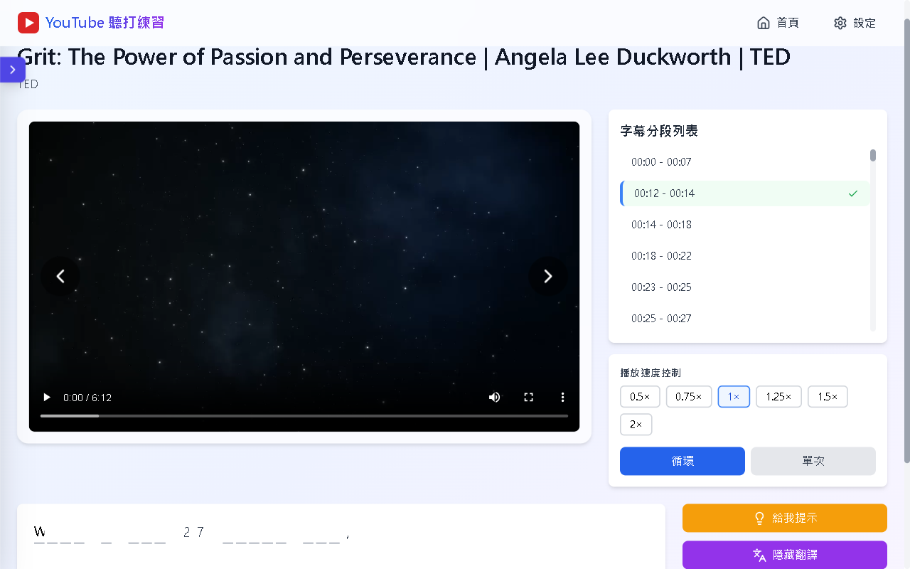
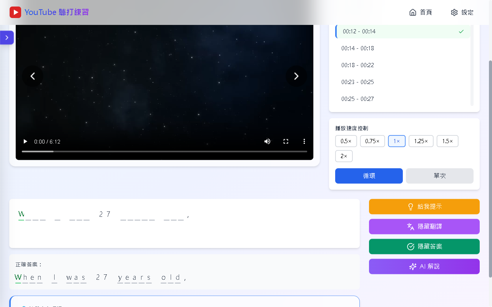
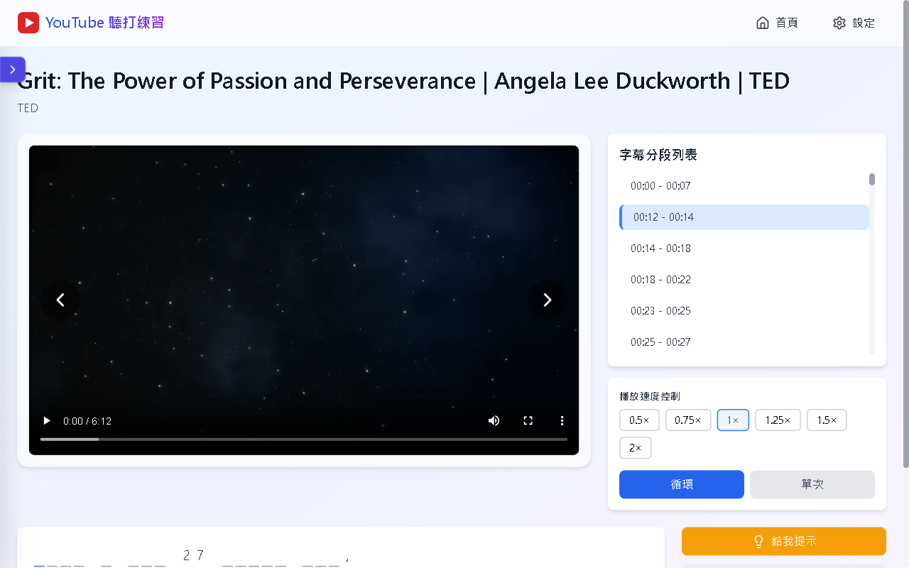
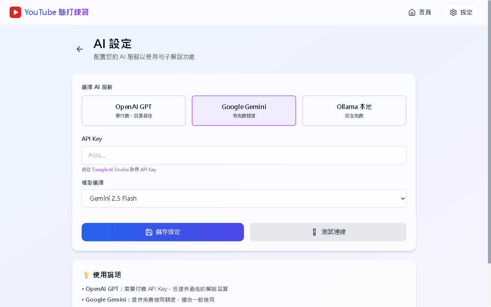

# YouTube 聽打練習

透過 YouTube 影片進行英文聽力與拼寫訓練的練習工具，適合想要用真實影片素材加強英語聽力、提升拼字準確度，或針對特定主題大量練習的學習者使用。

## 功能特色

✅ **下載 YouTube 影片，自動產生填空題**


✅ **逐句聽打練習，支援提示與翻譯**

| 提示與翻譯輔助  | 即時答案對照 |
|-------|-------|
|  |  |

✅ **完整練習頁面，整合影片播放與字幕分段**



✅ **影片分類資料夾管理，快速切換練習素材**


✅ **AI 解說功能，支援 OpenAI、Gemini、Ollama**



## 🚀 快速啟動說明

### Windows 用戶

#### 🔧 前置準備（必須）

第一次使用前，請先安裝以下工具。

### 1. 安裝 Python 3.11+

下載連結：<https://www.python.org/downloads/>

安裝時請勾選：

```text
Add Python to PATH
```

安裝完成後，重新開啟 PowerShell，輸入：

```powershell
python --version
```

看到 Python 版本即代表安裝成功。

### 2. 安裝 Node.js LTS

下載連結：<https://nodejs.org/>

建議下載 LTS（長期支援）版本。

安裝完成後，重新開啟 PowerShell，輸入：

```powershell
node --version
npm --version
```

看到版本號即代表安裝成功。

### 3. 安裝 uv（Python 套件管理工具）

開啟 PowerShell，執行：

```powershell
powershell -ExecutionPolicy ByPass -c "irm https://astral.sh/uv/install.ps1 | iex"
```

安裝完成後，重新開啟 PowerShell，輸入：

```powershell
uv --version
```

看到版本號即代表安裝成功。

### 下載專案

開啟 PowerShell，執行：

```powershell
git clone https://github.com/your-repo/Youtube_ListenFill.git
cd Youtube_ListenFill
```

如果你的電腦沒有 Git，也可以在 GitHub 頁面點選：

```text
Code > Download ZIP
```

下載後解壓縮，再進入專案資料夾。

### 一鍵啟動

在專案資料夾中，直接執行：

```bat
setup_and_start.bat
```

啟動後開啟：

- 練習頁面：`http://localhost:5173`
- 後端服務：`http://localhost:8000`

第一次使用 AI 解說功能前，請到右上角「設定」頁面輸入 API Key。

### macOS / Linux 用戶

執行：

```bash
chmod +x setup_and_start.sh
./setup_and_start.sh
```

### 手動啟動（進階）

後端：

```bash
cd backend
uv sync
uv run python app.py
```

前端：

```bash
cd frontend
npm install
npm run dev
```

### 常見啟動問題

- `python` 不是內部或外部命令：請重新安裝 Python，並勾選 `Add Python to PATH`。
- `node` 或 `npm` 找不到：請重新安裝 Node.js LTS。
- `uv` 找不到：請重新執行 uv 安裝指令，並重新開啟 PowerShell。
- 網頁打不開：確認後端與前端兩個視窗都有成功啟動。
- 字幕下載失敗：請確認該影片有英文字幕（自動生成或手動上傳皆可）。

## 使用流程

1. 開啟 `http://localhost:5173`。
2. 在首頁貼上 YouTube 影片網址，點擊「下載影片」。
3. 等待下載與字幕翻譯完成。
4. 在影片列表點擊「開始練習」進入練習頁面。
5. 觀看影片播放當前段落，在填空格中輸入聽到的字母。
6. 使用「給我提示」取得下一個字母提示。
7. 使用「顯示翻譯」查看中文翻譯。
8. 使用「檢查答案」對照正確答案。
9. 需要更深入說明時，點擊「AI 解說」取得文法與用法解析。

## 使用提醒

- 影片必須有英文字幕（自動或手動）才能下載。
- 下載的影片與字幕會存在本機 `backend/downloads/` 資料夾。
- 學習進度自動儲存於瀏覽器 LocalStorage，下次開啟自動恢復。
- AI 解說功能需先至「設定」頁面輸入 API Key（OpenAI / Gemini），或啟動本機 Ollama 服務。
- 翻譯使用 Google Translate 免費版，可能有請求頻率限制。

## 授權

本專案目前未附正式授權條款。若要公開散佈、二次開發或商用，請先補上授權說明。
